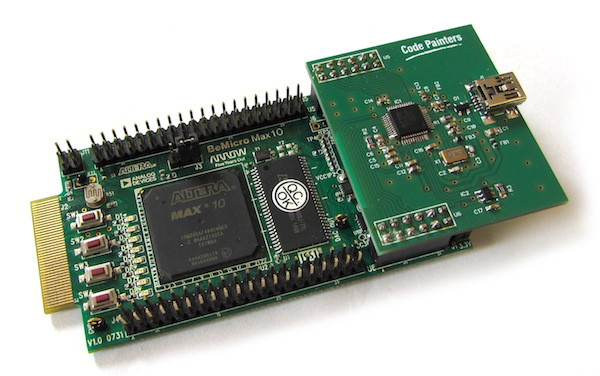

Be\_FTDI
========

Simple `FT232H`-based USB interface for the great [BeMicro Max10](http://www.alterawiki.com/wiki/BeMicro_Max_10) FPGA board.  

The interface uses `FTDI FT232H` in synchronous FIFO mode. Throughput achieved in testing:

 * PC (Ubuntu 16.04, kernel 4.4.0)  - 21.5 MB/s upstream (FPGA to PC), 31.2 MB/s downstream (PC to FPGA)
 * MacBook Pro (OS X 10.10.5) - 25.7 MB/s upstream, 37.6 MB/s downstream

See [tests](tests) directory for VHDL & C test code.

All the project files are licensed under Modified BSD License (see [LICENSE.txt](LICENSE.txt)).
